# Bootcamp de AI
## Inteligência Artificial na Prática 

<div class="MCWHeader3">
Fevereiro 2021
</div>
<br>

**Conteúdo**

<!-- TOC -->

- [Bootcamp de AI](#bootcamp-de-ai)
  - [Inteligência Artificial na Prática](#inteligência-artificial-na-prática)
  - [Objetivo](#objetivo)
  - [Arquitetura Proposta](#arquitetura-proposta)
  - [Serviços Utilizados](#serviços-utilizados)
  - [Configuração do Ambiente](#configuração-do-ambiente)
    - [Tarefa 1: Criação do Grupo de Recurso](#tarefa-1-criação-do-grupo-de-recurso)
    - [Tarefa 2: Criação do Azure Storage](#tarefa-2-criação-do-azure-storage)
      - [Task 2.1: Preenchendo as configurações do Azure Storage](#task-21-preenchendo-as-configurações-do-azure-storage)
    - [Tarefa 3: Criar o serviço Cognitive Services - Speech](#tarefa-3-criar-o-serviço-cognitive-services---speech)
      - [Task 3.1: Preenchendo as configurações do Speech](#task-31-preenchendo-as-configurações-do-speech)
    - [Tarefa 4: Criar o serviço Cognitive Services - LUIS](#tarefa-4-criar-o-serviço-cognitive-services---luis)
      - [Task 4.1: Preenchendo as configurações do Luis](#task-41-preenchendo-as-configurações-do-luis)
    - [Tarefa 5: Criar o serviço Cognitive Search](#tarefa-5-criar-o-serviço-cognitive-search)
      - [Task 5.1: Preenchendo as configurações do Search](#task-51-preenchendo-as-configurações-do-search)
  - [Execução dos Notebooks](#execução-dos-notebooks)
    - [Tarefa 1: Criar o aplicação do LUIS](#tarefa-1-criar-o-aplicação-do-luis)
    - [Tarefa 2: Realizar a Transcrição e Classificação dos áudios](#tarefa-2-realizar-a-transcrição-e-classificação-dos-áudios)
    - [Tarefa 3: Realizar o upload dos arquivos no Blob Storage](#tarefa-3-realizar-o-upload-dos-arquivos-no-blob-storage)
    - [Tarefa 4: Realizar a busca dos áudios classificados](#tarefa-4-realizar-a-busca-dos-áudios-classificados)
  - [Visualização do resultado no Power Apps](#visualização-do-resultado-no-power-apps)

<!-- /TOC -->

## Objetivo
Solução para classificar ligações telefônicas e extrair informações dos áudios utilizando serviços do Azure.
<br>
<br>

## Arquitetura Proposta

   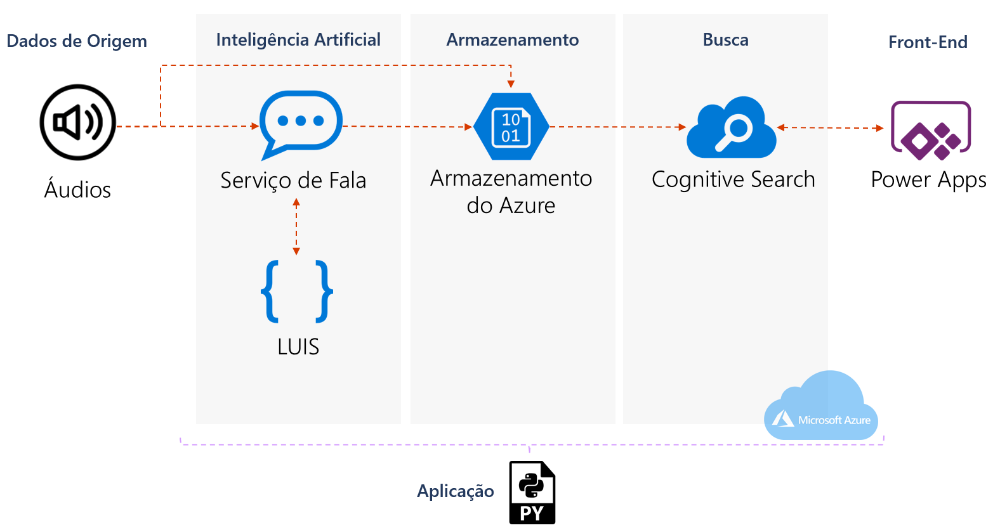
<br>
<br>

## Serviços Utilizados
| Serviço                     | Documentação                                                              |
|-----------------------------|---------------------------------------------------------------------------|
| Azure Storage - Blob        | https://docs.microsoft.com/pt-br/azure/storage/blobs/                     |
| Cognitive Services - Speech | https://docs.microsoft.com/pt-br/azure/cognitive-services/speech-service/ |
| Cognitive Services - LUIS   | https://docs.microsoft.com/pt-br/azure/cognitive-services/luis/           |
| Cognitive Search            | https://docs.microsoft.com/pt-br/azure/search/                            |
| Power Apps            | https://docs.microsoft.com/pt-br/powerapps/search/                            |
<br>
<br>

## Configuração do Ambiente

Nessa etapa, serão apresentadas as configurações do ambiente para ser possível implantar a arquitetura prospota apresentada acima.

### Tarefa 1: Criação do Grupo de Recurso

1. No [portal do Azure](https://portal.azure.com), selecione **Resource groups** na lista de serviços do Azure.

   

2. Na lista abaixo de **Resource groups**, selecione **+ Add**.

   

3. Na aba **Basics**, preencha as informações abaixo:

   Project details:
   - **Subscription**: Selecione a subscrição que está utilizando para esse workshop.
   - **Resource group**: Digite `hands-on-lab-SUFFIXO` como nome do seu grupo de recursos, onde SUFFIXO é o seu apelido, iniciais, ou outro valor para garantir um nome único.

   Resource details:
   - **Region**: Selecione a região que está utilizando para realizar esse workshop.

   

4. Selecione **Review + Create**.

5. Na aba **Review + create**, confirme se há uma mensagem de Validation passed e então clique em **Create**.

<br>

### Tarefa 2: Criação do Azure Storage
Nessa tarefa, você provisionará um serviço de armazemento do Azure, onde você irá armazenar os audios de ligações telefonicas e o resultado das transcrições das mesmas.
1. No [portal do Azure](https://portal.azure.com/), clique em **Show portal menu** no canto superior direito e escolha **+Create a resource** do menu.

   

2. Busque por **storage** e selecione **Storage Account**.
   
   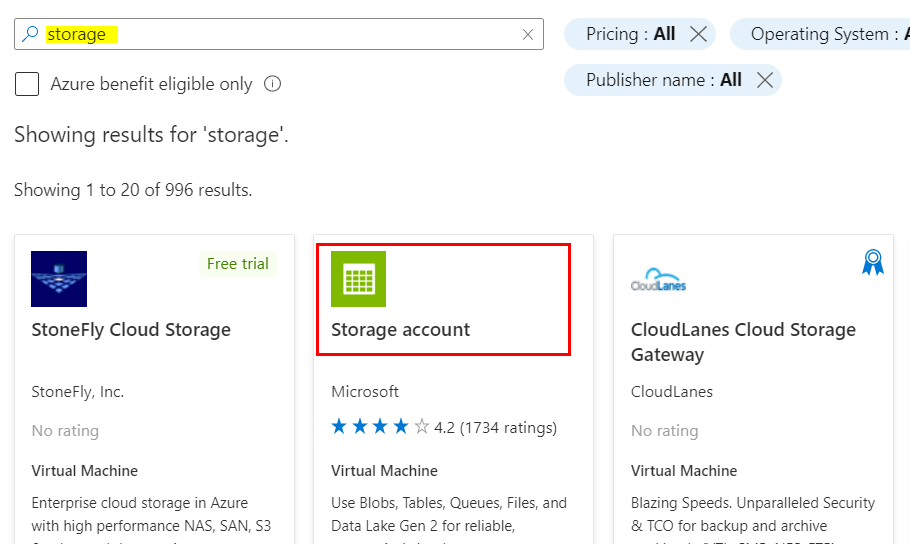

3. Clique em **Create**.

      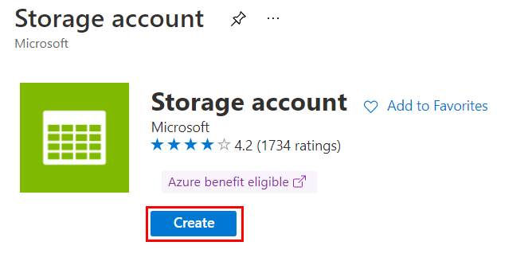

4. Na aba **Basics**, preencha as informações abaixo:
   
    Project details:
   - **Subscription**: Selecione a subscrição que está utilizando para esse workshop.
   - **Resource group**:  Selecione o resoruce group hands-on-lab-SUFFIX na lista.

   Instance details:
   - **Storage Account Name**: Digite *storageSUFFIXO* como nome de sua conta de armazenamento.
   - **Location**: Selecione a região que está utilizando para realizar esse workshop.
   - **Performance**: Selecione *Standard*.
   - **Account Type**: Selecione *BlobStorage*.
   - **Replication**: Selecione *Locally-redundant storage (LRS)*.

      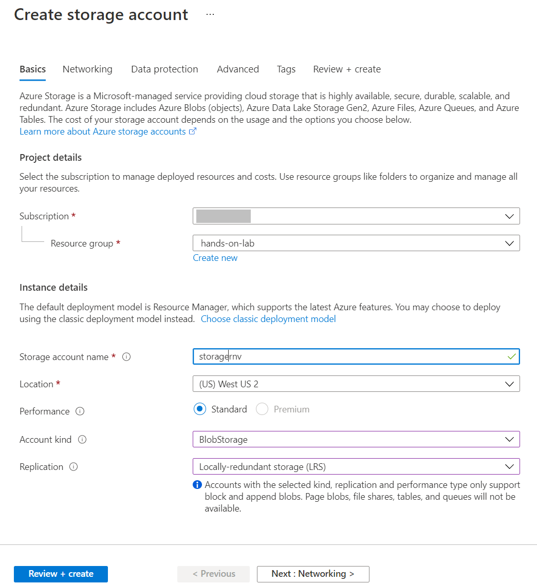

5. Na aba **Review + create**, confirme se há uma mensagem de Validation passed e então clique em **Create**.
   <br>
#### Task 2.1: Preenchendo as configurações do Azure Storage

Nessa etapa iremos preencher o arquivo **config\config_example.yml** com as configurações necessárias para acessar o Azure Storage.

1. Na barra de busca, busque por *storage* e selecione **Storage accounts**:
   
         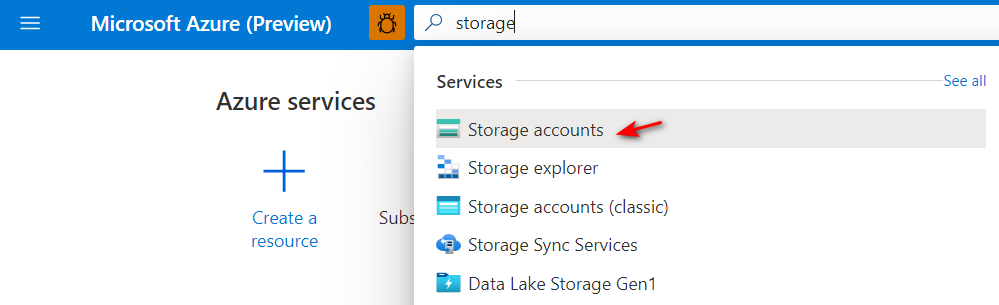

2. Clique no storage account criado anteriormente storageSUFFIX.
   
   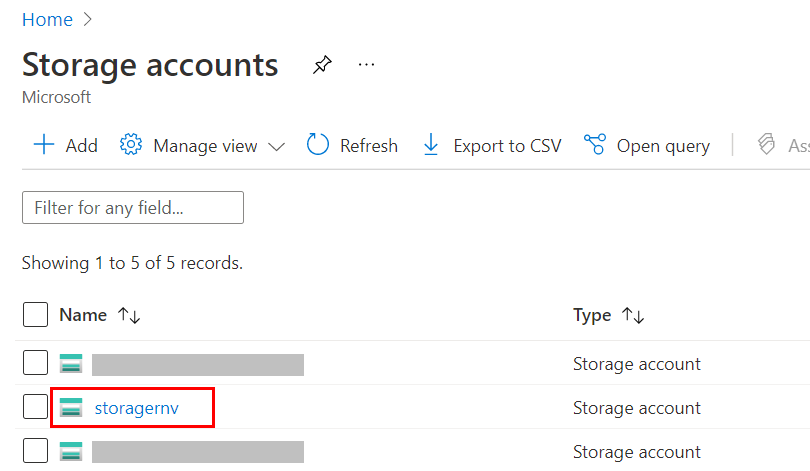

3. No diretório **config** local abra o arquivo **config.yml** e preencha as seguintes informações:
      * Acesse *Keys and Endpoints*:
        * **storage_name:** Copie o valor de *Storage account name*
        * **conn_string:** Copie os dados de *key1* ou *key2*

      *  Acesse *Shared access signature*:
         * **sas_token:** No campo *Allowed resource types* selecione Service, Container e Object, selecione uma data até finalizar o workshop, clique em *Generate SAS and connection string* e por fim, copie o **SAS token** no campo *sas_token* entre aspas simples.
  
      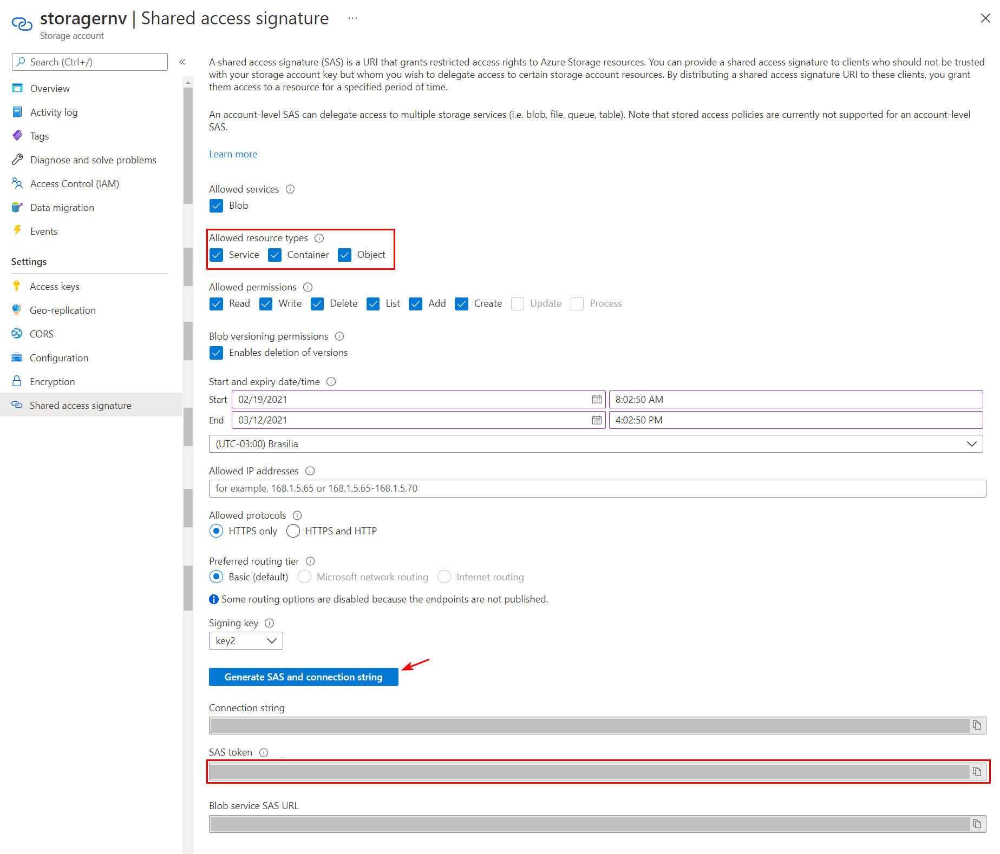

   Example:
   ```yaml
   ####################################################################################
   #
   #    Azure Storage - Blob
   # 
   ####################################################################################
   azure_storage:
   container_name: audios
   storage_name: storageSUFFIX
   conn_string:  hgrtweterwtetrrtrr
   sas_token: '?fjdfkshnshtuioi45r4t2rt1r' 

   ```

### Tarefa 3: Criar o serviço Cognitive Services - Speech

Nessa tarefa, será provisionado o serviço de Fala do Azure (Cognitive Services - Speech) para realizar as transcrições dos áudios.

1. No [portal do Azure](https://portal.azure.com/), clique em **Show portal menu** no canto superior direito e escolha **+Create a resource** do menu.

   

2. Busque por **speech** no Azure Marketplace list selecione **Speech** clique em Create e em seguida Create novamente.

   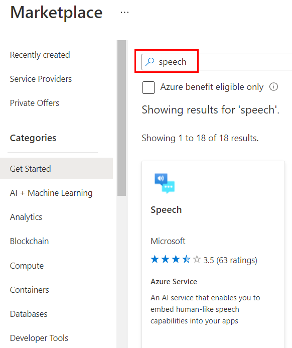

3. Na aba **Create**, preencha as informações abaixo:

    Project details:

   - **Subscription**: Selecione a subscrição que está utilizando para esse workshop.
   - **Resource group**:  Selecione o resoruce group hands-on-lab-SUFFIX na lista.

    Instance Details:

   - **Region**: Selecione a região que está utilizando para realizar esse workshop.
    - **Name:** Forneça um nome único para essa instância: speech-SUFFIX.
    - **Pricing tier**: Selecione Standard S0.

      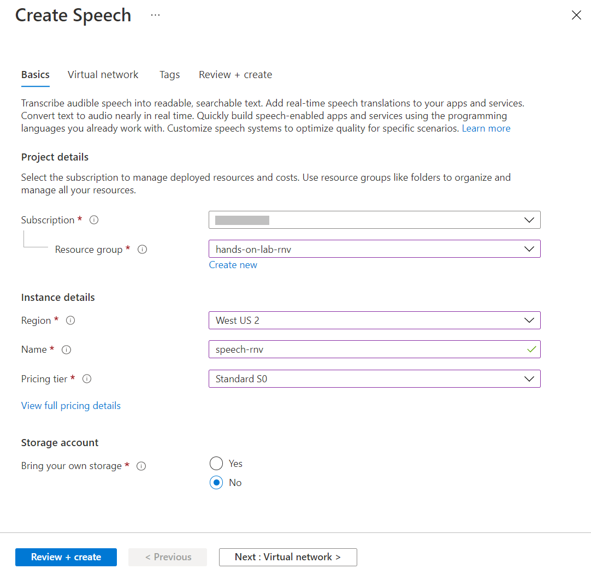

4. Na aba **Review + create**, confirme se há uma mensagem de Validation passed e então clique em **Create**.

#### Task 3.1: Preenchendo as configurações do Speech

Nessa etapa iremos preencher o arquivo **config\config_example.yml** com as configurações necessárias para acessar o Cognitive Services Speech.

1. Quando terminar o provisionamento clique em  **Go to resource**:
   

2. No diretório **config** local abra o arquivo **config.yml** e preencha as seguintes informações:
   * Acesse *Keys and Endpoints*:
     *   **speech_key:** Copie os dados de *KEY 1* ou *KEY 2*
     *   **speech_region:** Copie os dados de *Location*

   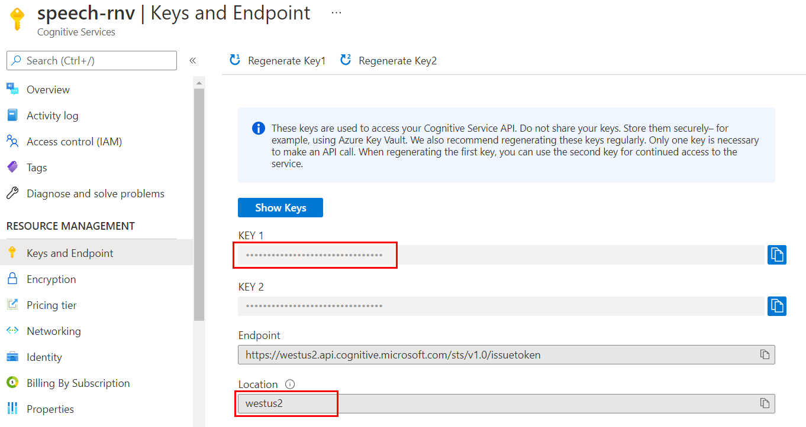

Exemplo:
   ```yaml
   ####################################################################################
   #
   #    Cognitive Services - Speech
   # 
   ####################################################################################
   speech:
   speech_key: 029kdsjdhsdjkds8d81cb
   speech_region: westus2
   speech_language: pt-br

   ```

### Tarefa 4: Criar o serviço Cognitive Services - LUIS

Nessa tarefa, será provisionado o serviço de Fala do Azure (Cognitive Services - LUIS) para realizar a classificação dos áudios.

1. No [portal do Azure](https://portal.azure.com/), clique em **Show portal menu** no canto superior direito e escolha **+Create a resource** no menu.

   

2. Busque por **luis** no Azure Marketplace list selecione **Language Understanding** clique em Create e em seguida Create novamente.

   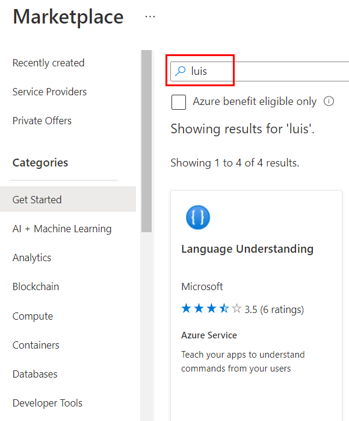

3. Na aba **Create**, preencha as informações abaixo:

   Create Options: **Authoring** 

    Project details:

   - **Subscription**: Selecione a subscrição que está utilizando para esse workshop.
   - **Resource group**:  Selecione o resoruce group hands-on-lab-SUFFIX na lista.
   - **Name:** Forneça um nome único para essa instância: luis-SUFFIX.

    Authoring Resource:

   - **Region**: Se não houver a região que está utilizando nos outros recursos do workshop,selecione a região que está mais próxima.
   - **Authoring Pricing tier**: Selecione Free F0.

      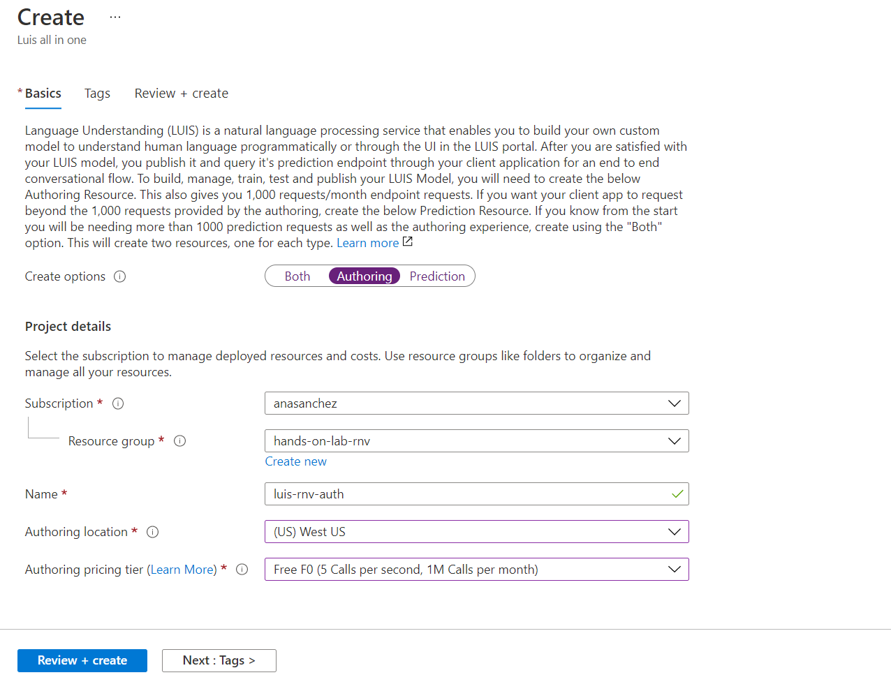

4. Na aba **Review + create**, confirme se há uma mensagem de Validation passed e então clique em **Create**.

#### Task 4.1: Preenchendo as configurações do Luis

Nessa etapa iremos preencher o arquivo **config\config_example.yml** com as configurações necessárias para acessar o Cognitive Services LUIS.

1. Quando terminar o provisionamento clique em  **Go to resource**:
   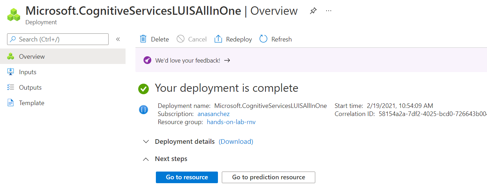

2. No diretório **config** local abra o arquivo **config.yml** e preencha as seguintes informações:
   * Acesse *Keys and Endpoints*:
     *   **auth_name:** Copie o nome do serviço
     *   **auth_key:** Copie os dados de *KEY 1* ou *KEY 2*
     *   **auth_region:** Copie os dados de *Location*

   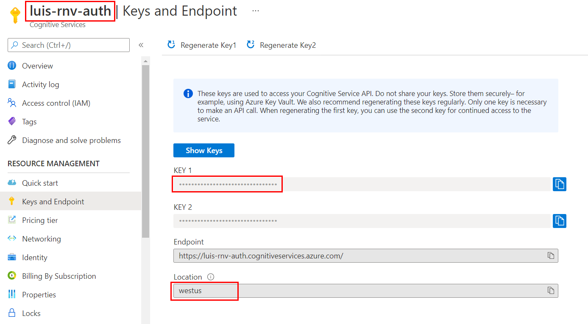

   Exemplo:
   ```yaml
   ####################################################################################
   #
   #   Cognitive Services - Language Understanding (LUIS)
   # 
   ####################################################################################
   luis_authoring:
   auth_name: luis-rnv-auth
   auth_key: 116b8645454545451b9a40
   auth_region: westus

   ```

### Tarefa 5: Criar o serviço Cognitive Search

Nessa tarefa, será provisionado o Cognitive Search para realizar a busca dos áudios.

1. No [portal do Azure](https://portal.azure.com/), clique em **Show portal menu** no canto superior direito e escolha **+Create a resource** do menu.

   

2. Busque por **search** no Azure Marketplace list selecione **Azure Cognitive Search** clique em Create e em seguida Create novamente.

   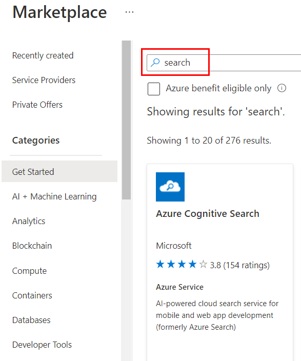

3. Na aba **Create**, preencha as informações abaixo:

   Create Options: **Authoring** 

    Project details:

   - **Subscription**: Selecione a subscrição que está utilizando para esse workshop.
   - **Resource group**:  Selecione o resoruce group hands-on-lab-SUFFIX na lista.

    Authoring Resource:

   - **Service Name:** Forneça um nome único para essa instância: luis-SUFFIX.
   - **Location**: Selecione a região que está utilizando para realizar esse workshop.
   - **Pricing tier**: Selecione Free F0.

      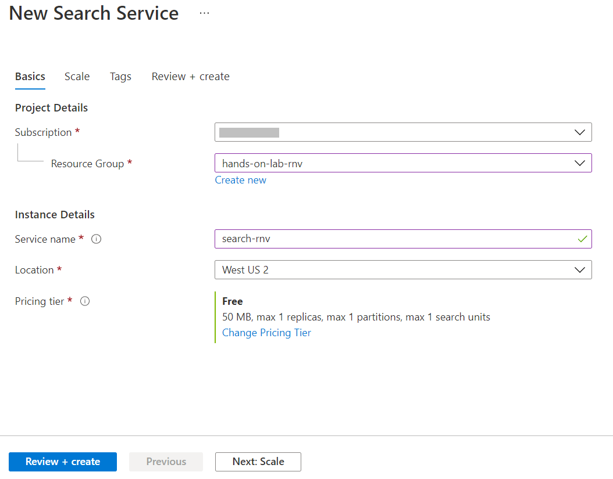

4. Na aba **Review + create**, confirme se há uma mensagem de Validation passed e então clique em **Create**.

#### Task 5.1: Preenchendo as configurações do Search

Nessa etapa iremos preencher o arquivo **config\config_example.yml** com as configurações necessárias para acessar o Cognitive Services LUIS.

1. Quando terminar o provisionamento clique em  **Go to resource**:
   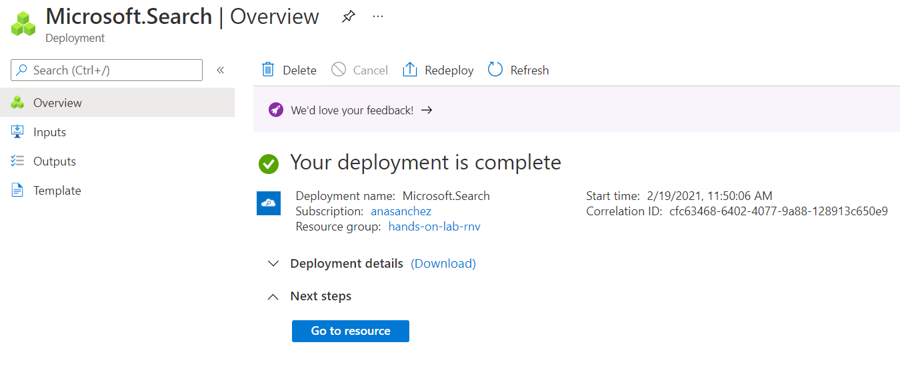

2. No diretório **config** local abra o arquivo **config.yml** e preencha as seguintes informações:
   * Acesse *Keys*:
     *   **service_name:** Copie o nome do serviço
     *   **admin_key:** Copie os dados de *Primary admin key* ou *Secondary admin key*

   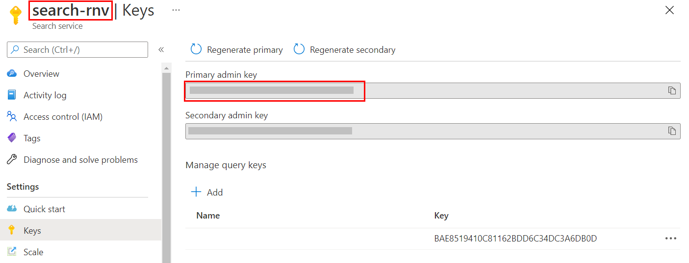

   Exemplo:
   ```yaml
   ####################################################################################
   #
   #    Cognitive Search
   # 
   ####################################################################################
   search:
   service_name: search-rnv
   admin_key: 1169B1dfggdfgdfDC485277
   index_name: audios-rnv
   api_version: '?api-version=2020-06-30'

   ```

## Execução dos Notebooks

### Tarefa 1: Criar o aplicação do LUIS

Nessa etapa será criada uma aplicação do LUIS via código realizando os seguintes passos:
* Criar as classes (intents)
* Adicionar Intenções
* Adicionar Entidades
* Adicionar a base de treino (utterances)
* Treinar o modelo
* Implantar um endpoint do modelo para ser consumido pelo servico Speech.

> Observação: Também seria possível criar através do [portal do LUIS](https://luis.ai).

Para realizar as atividades acima acessar o primeiro notebook: [1_create_luis](/1_create_luis.ipynb)

### Tarefa 2: Realizar a Transcrição e Classificação dos áudios

Nessa etapa será realizado a transcrições dos áudios através da API Search do Cognitive Services integrada ao modelo do LUIS criado na tarefa anterior.Para isso será realizado os seguintes passos:
* Transcrever os áudios com o Speech e LUIS
* Resumir resultado das classificações 
* Salvar as transcrições

Para realizar as atividades acima acessar o segundo notebook: [2_speech_plus_luis](/2_speech_plus_luis.ipynb)

### Tarefa 3: Realizar o upload dos arquivos no Blob Storage

Nessa etapa tanto os áudios quanto as transcrições serão salvas no Azure Storage. Para isso será realizado os seguintes passos:
* Criação dos Containers
* Upload dos Áudios e Transcrições
* Checar os arquivos

Para realizar as atividades acima acessar o segundo notebook: [2_speech_plus_luis](/2_speech_plus_luis.ipynb)

### Tarefa 4: Realizar a busca dos áudios classificados

Nessa etapa será realizado a criação do índice do Azure Search, e em seguida, a criação do documento json que irá popular o conteúdo do índice para possibilitar a busca dos audios. Para isso será realizado os seguintes passos:
* Criação do índice do Azure Search
* Criação do documento JSON do Azure Search
* Upload do documento JSON no Azure Search

Para realizar as atividades acima acessar o primeiro notebook: [3_search](/3_search.ipynb)

## Visualização do resultado no Power Apps

Nessa etapa será criado um app (front-end) para que os resultados da busca dos áudios sejam visualizados. Essa integração é da API do Azure Search com o PowerApps. 

1. Primeiramente é necessário criar um custom connector e para cria-lo, por favor siga o seguinte tutorial:  [Tutorial: Consultar um índice do Cognitive Search por meio do Power Apps](https://docs.microsoft.com/pt-br/azure/search/search-howto-powerapps) 
   
2.  A parte do select, para esse app não é necessária somente a configuração do Search, api-version e Content-Type conforme print abaixo:

        
    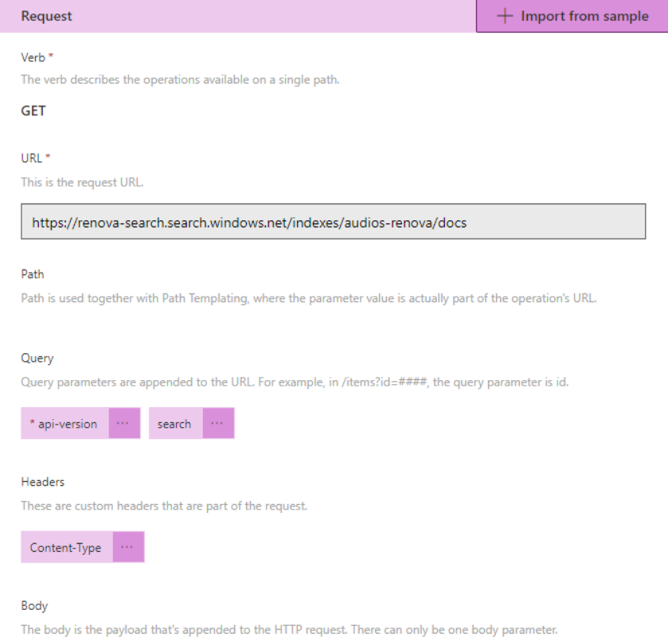

3. Posteriormente, é necessário a criação de um canvas para efetivamente fazer a visualização das palavras chaves e retornar a busca com os áudios. Para criar um canvas, siga o mesmo tutorial acima na parte *3-Visualize results*:

    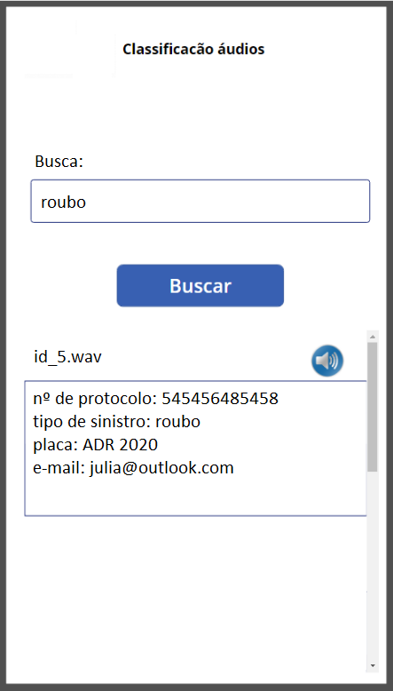


